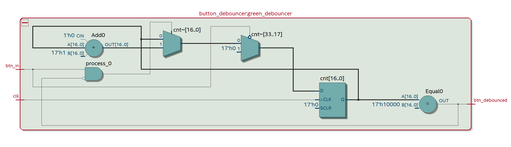

# button-debouncer

The goal of this component is to solve bouncing of an hardware button. In effect, when we press in an hardware button it possible that the signal don't move directly from LOW to HIGH state.

## Architecture RTL

## Interface

### Parameters

|  name  | description |
| :--- | :--- |
| **debounce_clk_cnt** | Number of `clk` rising edges during the `btn_in` should maintain an HIGH state to be propagated in the `btn_debounced` |

### Inputs / Outputs

|  pin input   | input description  |   output description             |  pin output                    |
|  :---   |  :--- | ---:                         |  ---:                    |
|  **clk**  |  clock input signal  |  Debounced button signal |  **btn_debounced**  |
|  **btn_in**  |  Connected to the physical button (with pull down resistor) | |  |

## Test Bench

